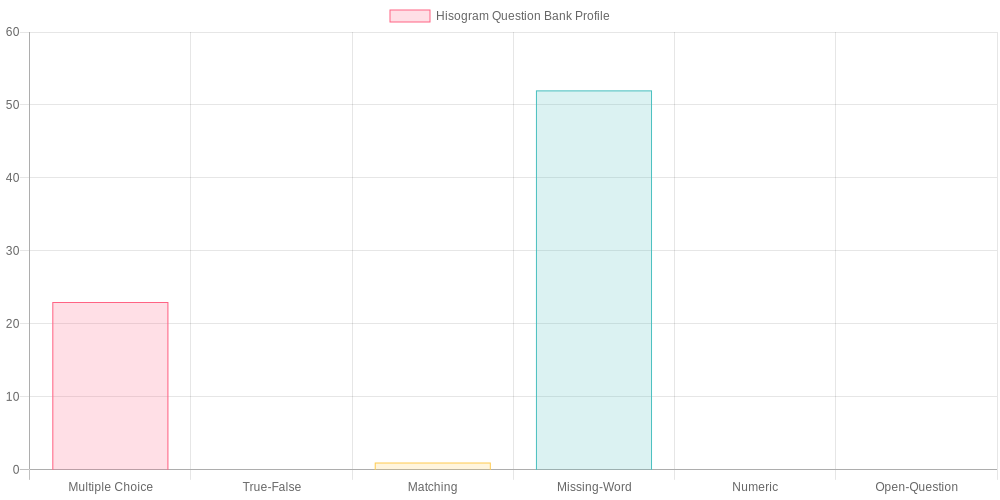
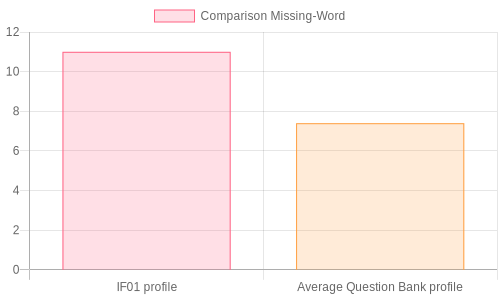

# Command line interface tool for the management of exams according to the GIFT format files in the national bank of the SRYEM services

## Installation

npm install

npm fund

## Setup

### Loading GIFT data files

In the parser directory, there are stored all the files from the Sryem national question bank in the SujetB_data directory. 

Usually, there is no need of using all of them. That's why, the teacher will specify at the beginning the files he wants to use for creating, modifying and comparing tests.

1 - Visualize all the file names

    node cli.js displayFileNames

2 - Choose the file to be loaded into the application

    node cli.js loadQB <file_name>

3 - Repeat step 2 until all the desired files are added

## Manipulate data - exam management

### Visualize the questions from the loaded files

    node cli.js read

### Create or edit a vcard

    node cli.js makeVcard

The teacher can create or edit his vcard.The teacher identifies, filling in the requested personal informations. The system will create 2 new directories (if they don't already exist): Test and TestBank. In both, another directory will be added, named after the inserted teacher (first name and last name separated by "_").

### Create an empty test

    node cli.js createTest

The teacher identifies, filling in the requested personal informations. The system will create 2 new directories (if they don't already exist): Test and TestBank. In both, another directory will be added, named after the inserted teacher (first name and last name separated by "_"). An empty gift file will be added to the Test/Teacher_Name directory. The name of the file will be the input provided by the user for the test name (spaces will be automatically replaced by "_").

The Test directory keeps the empty and unfinished tests of teachers. Once a test is finished and validated, it's moved to the teacher directory inside the TetBank directory. vCards are provided in every teacher directory.

### Add a question to a test

    node cli.js addQuestion

The application will request the teacher's name, the test name and the question number from the dataset.

### Visualize test questions

    node cli.js readTest <directory>

where directory should be either Test, wither TestBank. This way, a teacher can visualize both unfinished and finished test with the same command, only by changing the argument.

### Display teacher file names

    node cli.js <directory> <teacher-name>

where directory should be either Test, wither TestBank. This way, a teacher can visualize both unfinished and finished test file names (not content).

### Remove a question from a test

    node cli.js rmQuestion

The application will request the teacher's name, the test name and the question number of the test to be removed.

### Test verification and validation on completion

    node cli.js finish

The system will request again the teacher and the test names and will verify if the test contains 15-20 unique questions.

If there are any duplicates, the program will eliminate them automatically.

### Generate a profile histogram based on one or more GIFT files

    node cli.js visualizeProfile <file1> <file2> ... <fileN>

A question can be of type:
* Multiple Choice
* True-False
* Matching
* Missing-Word
* Numeric
* Open-Question

The command will get all the questions from the mentioned files and will count the number of questions for each category and them will generate a chart with the final profile.

### Compare a test profile with the average profile of one or several gift files

    node cli.js compare <file1> <fil2> ... <fileN>

The application will request the teacher and test names. The profile of every file will be calculated in order to create the average profile by summing each's corresponding values and dividing them by the number of files.

In the end, the test profile will be compared to the resulted average profile and charts will be generated, comparing each associated value.

### Simulate a test from a student point of view

    node cli.js takeTest

This will put the user solve a test and the answers will be verified in the end, displaying the wrong answers.
    

